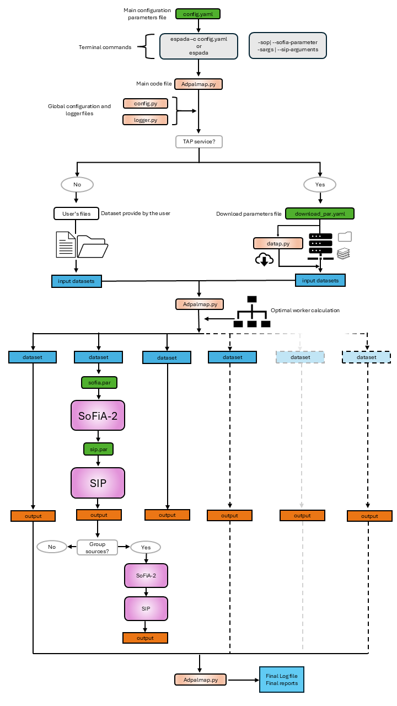

# ESPADA: Enhanced Spectral-line Pipeline for the ALMA Data Archive

> **Name note:** ESPADA was initially developed under the name **ADPALMAP**. Some legacy names may still appear in the code base, repository name, command-line entry point, documentation, or output labels. The command-line executable is now `espada`.

ESPADA is an end-to-end Python pipeline for generating advanced spectral-line data products from ALMA data. It wraps and coordinates data discovery/download from the ALMA Science Archive, source finding and parameterisation with [SoFiA-2](https://gitlab.com/SoFiA-Admin/SoFiA-2), visualisation with the [SoFiA Imaging Pipeline (SIP)](https://github.com/kmhess/SoFiA-image-pipeline), optional grouping of related detections, logging, quality assessment, and final HTML/JSON reports.

ESPADA is designed for minimal user intervention, while still allowing users to override the main pipeline configuration, SoFiA parameters, and SIP arguments when needed.

📘 **Full documentation:** [ESPADA Documentation](adplib/doc/ESPADA_DOC.pdf)

## Contents

- [Main features](#main-features)
- [Workflow overview](#workflow-overview)
- [Requirements](#requirements)
- [Installation](#installation)
- [Quick start](#quick-start)
- [Running ESPADA](#running-espada)
- [Configuration files](#configuration-files)
- [Input data](#input-data)
- [Outputs](#outputs)
- [Quality assessment and reports](#quality-assessment-and-reports)
- [Advanced usage](#advanced-usage)
- [Known limitations](#known-limitations)
- [Troubleshooting](#troubleshooting)
- [Acknowledgements](#acknowledgements)
- [Citation and license](#citation-and-license)

## Main features

- Query and download ALMA Science Archive (ASA) products through TAP/ADQL services.
- Run SoFiA-2 source finding in `emission`, `absorption`, or `both` modes.
- Generate SIP visualisation products for detected sources.
- Process multiple FITS datasets in parallel with dynamic CPU/RAM-aware worker allocation.
- Optionally group spatially overlapping detections along the spectral axis.
- Generate execution logs, per-dataset QA products, and interactive HTML plus machine-readable JSON reports.
- Re-run individual pipeline stages without re-running the full workflow, provided the expected intermediate products are available.

## Workflow overview

At a high level, ESPADA follows this sequence:

<p>
  
</p>

The main module, `espada`, orchestrates the workflow. The secondary modules are:

| Module | Role |
| --- | --- |
| `config` | Validate the main configuration and parameter files. |
| `logger` | Manage terminal and file logging. |
| `datap` | Query and download data from the ALMA Science Archive. |
| `sopar` | Prepare and run SoFiA-2. |
| `sipargs` | Translate `sip_args.yaml` into SIP command-line arguments. |
| `group` | Group overlapping source detections and re-process grouped masks. |
| `report` | Generate JSON and interactive HTML reports. |

## Requirements

ESPADA requires:

- Python `>= 3.10`.
- [SoFiA-2](https://gitlab.com/SoFiA-Admin/SoFiA-2) installed and callable as:

  ```bash
  sofia
  ```

- [SoFiA Imaging Pipeline (SIP)](https://github.com/kmhess/SoFiA-image-pipeline) installed and callable as:

  ```bash
  sofia_image_pipeline
  ```

- [Ghostscript](https://www.ghostscript.com/) for the final HTML report and for converting SoFiA EPS diagnostic plots to PNG for browser display.

  Debian/Ubuntu:

  ```bash
  sudo apt-get install ghostscript
  ```

  macOS with Homebrew:

  ```bash
  brew install ghostscript
  ```

SIP combined images may also require ImageMagick if the SIP `combo` option is used.

### Recommended Python environment

Using an isolated environment is strongly recommended. One possible setup with `pyenv` is:

```bash
curl https://pyenv.run | bash
# Follow the shell instructions printed by pyenv, then reload your shell.
source ~/.bashrc

pyenv install 3.10
pyenv virtualenv 3.10 espada
pyenv activate espada
```

To leave the environment:

```bash
pyenv deactivate
```

## Installation

Clone the repository and install it in editable/development mode:

```bash
git clone https://github.com/Borjamomo96/ADP-ALMA-Pipeline.git
cd ADP-ALMA-Pipeline
python -m pip install -e .
```

Editable mode is recommended because it keeps all repository files available, including default configuration and parameter templates. Installing without `-e` may work, but some non-Python files may be unavailable depending on the packaging configuration.

Verify that the command-line entry point is available:

```bash
espada --help
```

## Quick start

1. Install ESPADA, SoFiA-2, SIP, and Ghostscript.
2. Copy or edit the default `config.yaml` template.
3. Choose one input route:
   - local FITS datasets through `input_data_set` or `input_file`, or
   - automatic ASA query/download through `enable_tap_service: True` and `download_par.yaml`.
4. Run:

```bash
espada -c config.yaml
```

A minimal local-input run might use:

```yaml
make_report: True
output_dir: espada_run/

enable_tap_service: False
input_data_set: [data_cube.fits, primary_beam.fits, mask.fits, continuum.fits]

enable_sofia: True
run_mode: both
use_pb: True
use_mask: True
abs_flag_cube: True
auto_setup: True

enable_sip: True
enable_group: False
```

A TAP-based run should set `enable_tap_service: True` in `config.yaml` and define the archive query in `download_par.yaml`.

## Running ESPADA

The recommended execution method is the installed command-line interface:

```bash
espada -c config.yaml
```

ESPADA can search for a default `config.yaml` if no file is provided, but passing `-c` explicitly is recommended for reproducibility.

### Command-line arguments

| Argument | Purpose |
| --- | --- |
| `-c`, `--config-file` | Path to the main ESPADA configuration file. |
| `-cp`, `--config-parameters` | Override `config.yaml` parameters from the terminal using `parameter=value`. Spaces are not allowed inside each assignment. |
| `-sop`, `--sofia-parameters` | Override SoFiA parameters using native SoFiA syntax, e.g. `linker.radiusXY=2`. Overrides apply to all SoFiA parameter files used in the run. |
| `-sarg`, `--sip-arguments` | Append native SIP command-line arguments, e.g. `-sarg -i 0.15 -m`. This argument should be placed last. |
| `-i`, `--info` | Print information about parameter files or individual parameters, e.g. `-i file=config.yaml` or `-i parameter=make_report`. |
| `--debug` | Enable debug logging and traceback output. |
| `-h`, `--help` | Show help. |

Examples:

```bash
espada -c config.yaml
espada -c config.yaml -cp enable_tap_service=False input_file=espada_run/espada_input_file.txt
espada -c config.yaml -cp num_cores=5
espada -c config.yaml -sop linker.radiusXY=2 pipeline.verbose=true
espada -c config.yaml -sarg -i 0.15 -m
espada -c config.yaml --debug
espada -i file=config.yaml
espada -i parameter=filename_must_include
```

Important notes:

- Do not add other ESPADA arguments after `-sarg`/`--sip-arguments`; they may be interpreted as SIP arguments or ignored.
- Some SoFiA parameters are controlled internally by ESPADA and cannot be safely overridden. See [SoFiA parameter handling](#sofia-parameter-handling).

## Configuration files

ESPADA uses YAML configuration files, except for the native SoFiA `.par` files.

### `config.yaml`

`config.yaml` is the main pipeline configuration file. It controls the global workflow, input data, archive downloads, SoFiA execution, SIP execution, grouping, logging, output directory, and report generation.

| Block | Parameters | Description |
| --- | --- | --- |
| General | `make_report`, `verbose`, `num_cores`, `output_dir` | Enable final reports, control terminal verbosity, set the maximum core budget, and choose the main output directory. |
| Logger | `clear_logs`, `log_file` | Configure log cleanup and log-file location. |
| Input data | `input_data_set`, `input_file` | Provide local data cube, primary beam, mask, and continuum files. |
| TAP service | `enable_tap_service`, `download_par_file` | Enable ASA download and point to `download_par.yaml`. |
| SoFiA | `enable_sofia`, `run_mode`, `use_pb`, `use_mask`, `abs_flag_cube`, `auto_setup`, `sofia_abs_file`, `sofia_emi_file` | Configure source finding. |
| SIP | `enable_sip`, `sip_par_file` | Configure SIP image generation. |
| Group | `enable_group`, `overlap_mode`, `overlap_threshold` | Configure optional grouping of overlapping detections. |

Common values:

- `run_mode`: `emission`, `absorption`, or `both`.
- `overlap_mode`: `absflux`, `flux`, or `area`.
- `overlap_threshold`: value between `0` and `1`; the default documented value is `0.8`.

### `download_par.yaml`

`download_par.yaml` configures the `datap` module. It is used only when `enable_tap_service: True`.

It contains three main groups:

1. **Server settings**
   - `server_address`: ALMA archive mirror, e.g. ESO, NRAO, or NAOJ URL.
   - `credentials`: allow ALMA Science Portal login.
   - `stored_credentials`: cache credentials between runs.

2. **Query settings**
   - `query_type`: one of `proposal`, `member_ous_id`, `conesearch`, `target`, `keysearch`, or `free`.
   - `query_par`: parameters for the selected query type plus common filters such as `public`, `published`, `point`, `print_targets`, and `print_query`.

3. **Download settings**
   - `data_dir`: destination for downloaded data.
   - `remove_compressed_file`: remove extracted compressed archive files after processing.
   - `remove_archive_mask`: remove the original floating-point archive mask after creating the integer mask required by SoFiA-2.
   - `dryrun`: inspect download size and URLs without downloading.
   - `print_urls`: print download URLs.
   - `filename_must_include`: restrict downloads to URLs containing specific strings.

Example proposal query:

```yaml
query_type: proposal
query_par:
  proposal_id: "2016.1.00778.S"
  point: False
  public: True
  published: False
  print_targets: True
  print_query: True
```

Example target query:

```yaml
query_type: target
query_par:
  sources: ["V605 Aql"]
  search_radius: 2.0
  point: False
  public: True
  published: False
  print_targets: True
  print_query: True
```

Example key search:

```yaml
query_type: keysearch
query_par:
  search_dict:
    target_name: ["NGC4418"]
    proposal_id: ["2022.1.00738.S"]
  point: False
  public: True
  published: False
  print_targets: True
  print_query: True
```

After a TAP-based execution, ESPADA writes `espada_input_file.txt` inside the main output directory. This file lists the downloaded datasets in the format expected by `input_file`, so the same data can be reprocessed without querying the archive again.

### SoFiA parameter files

ESPADA uses separate SoFiA parameter files for absorption and emission runs:

- `sofia_abs_default.par`
- `sofia_emi_default.par`

Users may edit these files or provide alternative files through `sofia_abs_file` and `sofia_emi_file`.

#### SoFiA parameter handling

The following SoFiA parameters are controlled or constrained by ESPADA because they affect the pipeline workflow:

| Parameter(s) | ESPADA behaviour |
| --- | --- |
| `input.data`, `input.primaryBeam`, `input.mask` | Controlled by `config.yaml` input settings or by the `datap` module. Values in SoFiA files are ignored. |
| `input.invert` | Controlled through `run_mode`. |
| `pipeline.threads` | Calculated internally from `num_cores`, worker count, and SoFiA recommendations. Values are kept between `1` and `8`. |
| `scfind.enable`, `contsub.enable`, `scaleNoise.enable`, `background.enable`, `threshold.enable`, `reliability.enable`, `dilation.enable` | Automatically disabled when a mask is actively used. |
| `output.directory` | Controlled by `output_dir`. |
| `output.filename` | Partially controlled by ESPADA to distinguish datasets and modes. |
| `output.writeCatXML` | Forced on, because SIP and ESPADA metadata handling require XML catalogues. |
| `output.writeCubelets` | Forced on, because SIP needs cubelets for visualisation. |

When `auto_setup: True`, ESPADA can adjust selected SoFiA settings from FITS header information, including smoothing/linking-related parameters. Treat this feature as experimental and check the logs for parameter changes.

### `sip_args.yaml`

`sip_args.yaml` adapts SIP command-line options to YAML. ESPADA reads this file to build the SIP command.

Common SIP options include:

| Parameter | Description |
| --- | --- |
| `catalog_file` | SoFiA catalogue file (`.txt` or `.xml`) to use when SoFiA is disabled. |
| `source_id` | Source IDs to plot; `0` makes a field summary image, `-1` makes all sources plus summary images. |
| `output_image_file_type` | Output image format, commonly `png`. |
| `spec_full_range` | Plot spectra over the full spectral range. |
| `syn_beam_dimension` | User-provided beam dimensions if missing from FITS headers. |
| `channel_width` | Required when only moment maps are available. |
| `min_size` | Minimum image size in arcmin. |
| `snr_range` | SNR interval for the lowest contour. |
| `survey_list` | External survey overlays; use `none` for offline mode. |
| `combo` | Make combined images using ImageMagick. |
| `user_image` | User image for contour overlays. |
| `percentile_range` | Display percentile range for user images. |
| `spec_line` | Spectral line label/rest-frequency configuration. |
| `no_source_id` | Hide source IDs in plot titles. |
| `channel_maps` | Generate per-source channel-map PDFs. |
| `spec_only` | Generate spectra only. |
| `plot_units` | Plot moment-0 map units in Jy/beam km/s when applicable. |
| `overwrite` | Overwrite existing plots. |

## Input data

ESPADA inherits the input requirements of SoFiA-2. Input image data must be standard FITS files with a single HDU containing the image or data cube.

Each dataset can include up to four files, in this order:

1. Primary-beam-corrected data cube - **required**.
2. Primary beam cube - optional.
3. Mask cube - optional.
4. Continuum cube - optional and used by SIP when applicable.

Expected formats:

- Data and primary-beam cubes are normally 3D: two spatial axes plus one spectral axis.
- 2D images are accepted and treated internally as single-channel cubes.
- 4D files are accepted only when the fourth axis has length one; that axis is discarded.
- Masks must have the same dimensions as the data, use integer values, and contain non-zero values for source pixels.

Input can be provided directly with `input_data_set`, through an external `input_file`, or through the TAP service.

### `input_data_set`

Single dataset as a list:

```yaml
input_data_set: [data.fits, pb.fits, mask.fits, continuum.fits]
```

Single dataset as a string:

```yaml
input_data_set: data.fits pb.fits mask.fits continuum.fits
```

Multiple datasets as a dictionary:

```yaml
input_data_set:
  dataset_1: [data1.fits, pb1.fits, mask1.fits, continuum1.fits]
  dataset_2: [data2.fits, "", "", continuum2.fits]
  dataset_3: data3.fits pb3.fits mask3.fits
  dataset_4: data4.fits
```

Empty strings can be used as placeholders for missing optional files.

### `input_file`

`input_file` points to a text file containing one dataset per line. Do not use YAML list brackets inside this file.

```yaml
input_file: /path/to/espada_input_file.txt
```

Example file contents:

```text
1: data1.fits pb1.fits mask1.fits continuum1.fits
2: data2.fits pb2.fits mask2.fits continuum2.fits
3: data3.fits pb3.fits mask3.fits
```

The `use_mask` and `use_pb` options can disable masks or primary beams even when those files are present.

## Outputs

All outputs are written under `output_dir` from `config.yaml` (default: `espada_run/`). A typical run creates:

```text
output_dir/
├── archive_data/                    # optional; ASA downloads
├── log_dir/
│   ├── raw_espada_<date>_<time>.log
│   └── espada_<date>_<time>.log
├── espada_<dataset_name>/
│   ├── absorption_<dataset_name>_cubelets/
│   ├── absorption_<dataset_name>_figures/
│   ├── absorption_<dataset_name>_cat.txt
│   ├── absorption_<dataset_name>_cat.xml
│   ├── absorption_<dataset_name>_mask.fits
│   ├── absorption_<dataset_name>_mom0.fits
│   ├── absorption_<dataset_name>_mom1.fits
│   ├── absorption_<dataset_name>_mom2.fits
│   ├── absorption_<dataset_name>_sources.png
│   ├── absorption_<dataset_name>_logfile.log
│   ├── absorption_<dataset_name>_sip.log
│   ├── emission_<dataset_name>_cubelets/
│   ├── emission_<dataset_name>_figures/
│   ├── emission_<dataset_name>_cat.txt
│   ├── emission_<dataset_name>_cat.xml
│   ├── emission_<dataset_name>_mask.fits
│   ├── emission_<dataset_name>_mom0.fits
│   ├── emission_<dataset_name>_mom1.fits
│   ├── emission_<dataset_name>_mom2.fits
│   ├── emission_<dataset_name>_sources.png
│   └── quality_assessment_products/
│       ├── absorption_<dataset_name>_QA.png
│       ├── absorption_<dataset_name>_comparison_stats.txt
│       ├── emission_<dataset_name>_QA.png
│       └── emission_<dataset_name>_comparison_stats.txt
└── report_<date>_<time>/             # only when make_report=True
    ├── index.html
    ├── report.json
    ├── images/
    └── resources/
```

The exact files depend on enabled modules, run mode, and available inputs.

## Quality assessment and reports

ESPADA generates two QA layers.

### Stage I: per-dataset diagnostics

After each SoFiA execution, ESPADA can generate:

- A moment-8 image: maximum projection for emission or minimum projection for absorption along the spectral axis.
- A mask-comparison figure when an external/user/archive mask is available.
- Cube statistics extracted from the SoFiA XML catalogue: mean, standard deviation, skewness, kurtosis, and number of detected sources.
- A `*_comparison_stats.txt` file with quantitative diagnostic information.

These products are written to `quality_assessment_products/` inside each dataset output directory.

### Stage II: final HTML and JSON report

When `make_report: True`, the `report` module generates:

- `report.json`: a machine-readable summary of the run, including metadata, configuration, logs, per-dataset status, and output files.
- `index.html`: an interactive browser report with execution summary, dataset panels, QA galleries, SoFiA/SIP galleries, logs, and configuration views.

The report directory is self-contained and can be shared with collaborators as a single folder/archive.

## Advanced usage

### Re-running selected stages

ESPADA can skip stages that have already been run. For example, if SoFiA outputs already exist and follow ESPADA naming conventions, users can set:

```yaml
enable_sofia: False
enable_sip: True
```

ESPADA will attempt to infer the expected SoFiA products from the current configuration and input filenames.

### Parallelisation

ESPADA uses two levels of parallelism:

1. One Python worker process per dataset, up to the available CPU/RAM limit.
2. SoFiA-level threading inside each worker through `pipeline.threads`.

Worker allocation accounts for:

- user-provided `num_cores`,
- physical CPU count,
- available system memory,
- number of datasets,
- approximate SoFiA memory use per worker: `2.25 * data_size + 1 GB`.

SoFiA threads per worker are capped at `8`, following SoFiA performance recommendations.

### Grouping detections

When `enable_group: True`, ESPADA attempts to merge spatially overlapping SoFiA detections along the spectral axis.

The grouping algorithm:

1. Retrieves the 3D SoFiA detection mask.
2. Projects each detected source into a 2D footprint.
3. Computes pairwise overlap using `area`, `flux`, or `absflux`.
4. Creates connected groups of sources whose mutual overlap exceeds `overlap_threshold`.
5. Builds a grouped mask.
6. Re-runs SoFiA and SIP on grouped detections only.

The documented default choice, `overlap_mode: absflux` and `overlap_threshold: 0.8`, has worked well in limited point-source tests, but the optimal choice may depend on source morphology and science goals.

### TAP downloads and reprocessing

For TAP-based runs, ESPADA creates `espada_input_file.txt` in `output_dir`. To reprocess the same downloaded datasets without querying the archive again:

```yaml
enable_tap_service: False
input_file: espada_run/espada_input_file.txt
```

Keeping extracted primary-beam and converted mask files can also avoid repeated downloads and conversions in later runs.

## Known limitations

- The command-line executable is now `espada`.
- Some internal names may still contain ADPALMAP legacy labels.
- SoFiA and SIP executable names are assumed to be `sofia` and `sofia_image_pipeline`. Changing this inside ESPADA is possible but not recommended; installing the external tools so that those commands are available in `PATH` is preferred.
- Manually providing SIP `catalog_file` while using `run_mode: both` is not recommended. The current SIP YAML interface cannot specify separate absorption and emission catalogues for every dataset, which can lead to duplicated or incorrect SIP outputs.
- Manually provided SIP catalogues are discouraged for TAP-service runs because archive-download ordering may differ between executions.
- `auto_setup: True` is documented as experimental and should be checked against the generated logs and temporary SoFiA parameter files.

## Troubleshooting

| Symptom | Possible fix |
| --- | --- |
| `espada: command not found` | Activate the correct environment and run `python -m pip install -e .` from the repository root. |
| Python-related errors on import or syntax | Check that Python `>= 3.10` is active. |
| SoFiA or SIP fails immediately | Confirm that `sofia` and `sofia_image_pipeline` are installed and callable from the same environment. |
| HTML report misses SoFiA EPS diagnostic plots | Install Ghostscript and re-run report generation. |
| TAP run downloads more data than expected | Use `filename_must_include`, `dryrun: True`, and `print_urls: True` to inspect the selected products first. |
| Re-running a TAP dataset downloads files again | Reuse `espada_input_file.txt` with `enable_tap_service: False`, or keep extracted/converted files from the previous run. |
| SIP output is incorrect in `both` mode | Do not manually provide a single `catalog_file` list for `both`; run SoFiA through ESPADA or use separate `emission`/`absorption` runs. |

## Acknowledgements

ESPADA acknowledges support from the ESO/ALMA development study **"Prototype for ALMA Spectral Line Advanced Data Product Pipeline"**, funded through the ESO **Advanced Study for Upgrades of the Atacama Large Millimeter/submillimeter Array (ALMA)** framework.

The `datap` module incorporates and adapts functionality from [ALminer](https://alminer.readthedocs.io/), the ALMA archive mining and visualisation toolkit. ESPADA also relies on the external SoFiA-2 and SIP packages.

## Citation and license

A formal citation entry will be added when available. Users of ESPADA should also cite the relevant external tools and methods used in their analysis, including SoFiA-2, SIP, ALminer, and ALMA archive services as appropriate.

License information will be added when available.
